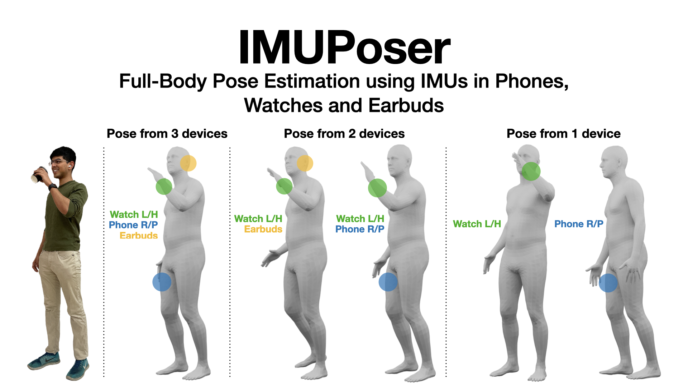

# IMUPoser: Full-Body Pose Estimation using IMUs in Phones, Watches, and Earbuds
<p align="center">
  
</p>

Research code for IMUPoser (CHI 2023)

## Reference
Vimal Mollyn, Riku Arakawa, Mayank Goel, Chris Harrison, and Karan Ahuja. 2023. IMUPoser: Full-Body Pose Estimation using IMUs in Phones, Watches, and Earbuds. In Proceedings of the 2023 CHI Conference on Human Factors in Computing Systems (CHI '23). Association for Computing Machinery, New York, NY, USA, Article 529, 1–12.

[Download Paper Here](https://drive.google.com/uc?export=download&id=1FYB52VN_v3ZIh99BNVLffXzqHRyD23rG)

BibTeX Reference:

```
@inproceedings{10.1145/3544548.3581392,
author = {Mollyn, Vimal and Arakawa, Riku and Goel, Mayank and Harrison, Chris and Ahuja, Karan},
title = {IMUPoser: Full-Body Pose Estimation Using IMUs in Phones, Watches, and Earbuds},
year = {2023},
isbn = {9781450394215},
publisher = {Association for Computing Machinery},
address = {New York, NY, USA},
url = {https://doi.org/10.1145/3544548.3581392},
doi = {10.1145/3544548.3581392},
booktitle = {Proceedings of the 2023 CHI Conference on Human Factors in Computing Systems},
articleno = {529},
numpages = {12},
keywords = {sensors, inertial measurement units, mobile devices, Motion capture},
location = {Hamburg, Germany},
series = {CHI '23}
}
```

## 1. Clone (or Fork!) this repository
```
git clone https://github.com/FIGLAB/IMUPoser.git
```
 
## 2. Create a virtual environment
We recommend using conda. Tested on `Ubuntu 18.04`, with `python 3.7`.

```bash
conda create -n "imuposer" python=3.7
conda activate imuposer
conda install pytorch==1.12.1 torchvision==0.13.1 torchaudio==0.12.1 cudatoolkit=10.2 -c pytorch

python -m pip install -r requirements.txt
python -m pip install -e src/
```

## 3. Training Steps
1. Start by preprocessing the AMASS and DIP-IMU datasets [scripts/1. Preprocessing](scripts/1.%20Preprocessing). Run all files in order.
2. Train the model [scripts/2. Train/run\_combos.sh](scripts/2.%20Train/run_combos.sh)

## Coming Soon!
1. IMUPoser Dataset
2. Real-Time Demo

## Disclaimer
```
THE PROGRAM IS DISTRIBUTED IN THE HOPE THAT IT WILL BE USEFUL, BUT WITHOUT ANY WARRANTY. IT IS PROVIDED "AS IS" WITHOUT WARRANTY OF ANY KIND, EITHER EXPRESSED OR IMPLIED, INCLUDING, BUT NOT LIMITED TO, THE IMPLIED WARRANTIES OF MERCHANTABILITY AND FITNESS FOR A PARTICULAR PURPOSE. THE ENTIRE RISK AS TO THE QUALITY AND PERFORMANCE OF THE PROGRAM IS WITH YOU. SHOULD THE PROGRAM PROVE DEFECTIVE, YOU ASSUME THE COST OF ALL NECESSARY SERVICING, REPAIR OR CORRECTION.

IN NO EVENT UNLESS REQUIRED BY APPLICABLE LAW THE AUTHOR WILL BE LIABLE TO YOU FOR DAMAGES, INCLUDING ANY GENERAL, SPECIAL, INCIDENTAL OR CONSEQUENTIAL DAMAGES ARISING OUT OF THE USE OR INABILITY TO USE THE PROGRAM (INCLUDING BUT NOT LIMITED TO LOSS OF DATA OR DATA BEING RENDERED INACCURATE OR LOSSES SUSTAINED BY YOU OR THIRD PARTIES OR A FAILURE OF THE PROGRAM TO OPERATE WITH ANY OTHER PROGRAMS), EVEN IF THE AUTHOR HAS BEEN ADVISED OF THE POSSIBILITY OF SUCH DAMAGES.
```

## Acknowledgments
Some of the modules in this repo were inspired by the amazing [TransPose](https://github.com/Xinyu-Yi/TransPose/) github repo. 

## License
The IMUPoser code can only be used for research i.e., non-commercial purposes. For a commercial license, please contact Vimal Mollyn, Karan Ahuja and Chris Harrison.

## Contact
Feel free to contact [Vimal Mollyn](mailto:ms123vimal@gmail.com) for any help, questions or general feedback!
