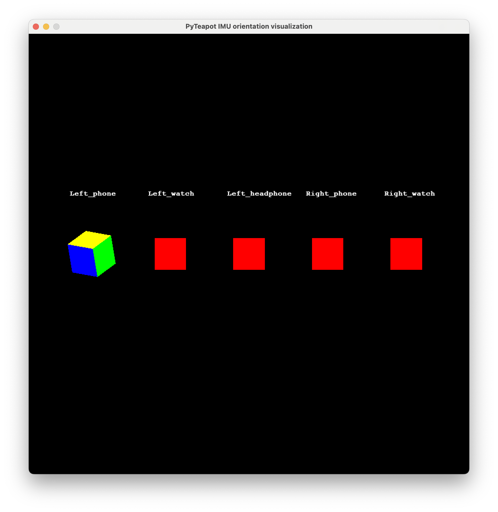

## 1. Stream IMU data
The IMUPoser app is on testflight - download at https://testflight.apple.com/join/SH4Mw2D8. If it's expired, contact us for a new link.

We stream IMU data from the devices to the laptop using a UDP Socket. Make sure your laptop and phone are on the same local network. Then enter your laptop's local IP address in the app and press "Create Socket".

Next, press "Start Phone" on the app to start streaming IMU data from the phone. 

For the watch, first open the IMUPoser app on the watch. Then press "Pair Watch" on the phone app. Then press "Start Watch" on the phone app.

## 2. Visualize IMU data
Run `python receive_viz_and_save.py --save` to visualize the IMU data. You should see a window like this:

If you want to align the IMU data of different devices to the same reference frame, press and hold "c" after clicking on the window.